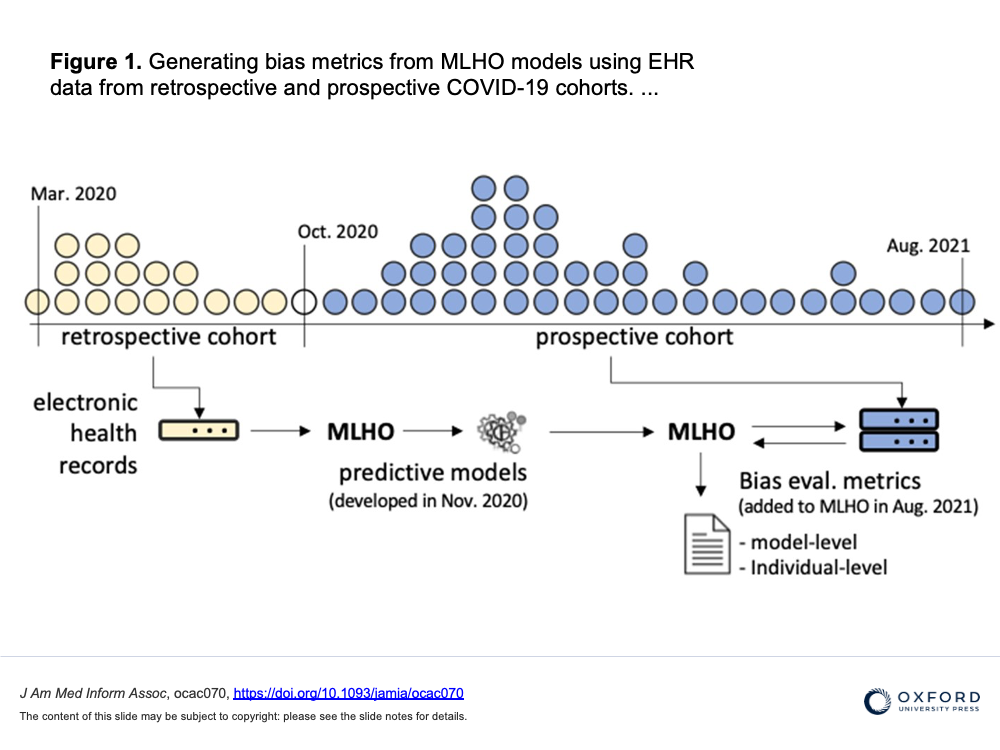

The increasing translation of artificial intelligence (AI)/machine learning (ML) models into clinical practice brings an increased risk of direct harm from modeling bias; however, bias remains incompletely measured in many medical AI applications. We used our own AI prediction models trained retrospectively on EHR data from the early months of the pandemic in Boston. for predicting risks of hospital and ICU admission, mechanical ventilation, and mortality after a SARS-CoV-2 infection purely based on their pre-infection data. 

 

Here we further evaluated the models both retrospectively and prospectively using model-level metrics of discrimination, accuracy, and reliability, and a novel individual-level metric for error. We found inconsistent instances of model-level bias in the prediction models. From an individual-level aspect, however, we found most all models performing with slightly higher error rates for older patients.

We discuss that while a model can be biased against certain protected groups (ie, perform worse) in certain tasks, it can be at the same time biased towards another protected group (ie, perform better). As such, current bias evaluation studies may lack a full depiction of the variable effects of a model on its sub-populations. As such, only a holistic evaluation, a diligent search for unrecognized bias, can provide enough information for an unbiased judgment of AI bias that can invigorate follow-up investigations on identifying the underlying roots of bias and ultimately make a change.

---
[link to open access publication in JAMIA](https://doi.org/10.1093/jamia/ocac070)

<small>feature graphic by Jenice Kim from <a href="https://www.nytimes.com/2019/01/31/opinion/ai-bias-healthcare.html" title="The New York Times">https://www.nytimes.com/2019/01/31/opinion/ai-bias-healthcare.html</a></small>
