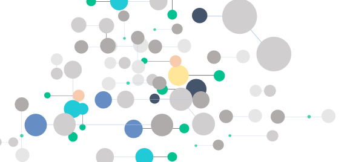

Diagnosis records in the EHRs are known to have reliability issues due to various underlying causes.

*"An EHR diagnosis record and its time stamp may not give the true disease state or the actual onset of the disease."*  

Our EHR sequencing technology has shown to be able to identify the `genuine moments` of diagnosis records. But the problem is not an easy one to solve. The video below illustrates the problem and solution in about 2 minutes.

<video width="700" controls>
  <source src="images/ICD_Story.mp4" type="video/mp4">
</video>

The sequences together create a massive feature space, creating a bottleneck for prior work in this area. 

We have developed a high-throughput dimensional reduction algorithm `MSMR` that enables us to identify sequences of EHR records that carry useful information for downstream ML algorithms. 
