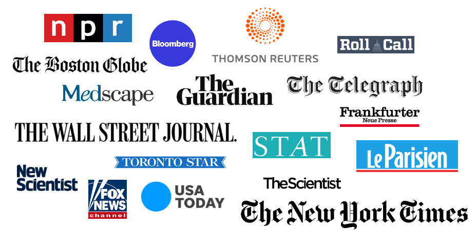

Our research has been covered in national and international media. More importantly, this coverage has informed the public and policy-makers and made impact on patients lives.

For instance, during the COVID-19 pandemic, our research has impacted prioritization of vaccines and decisions on rolling out booster shots.

 

