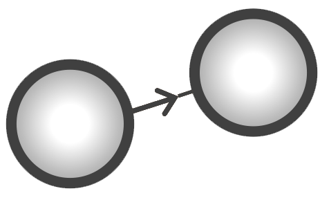
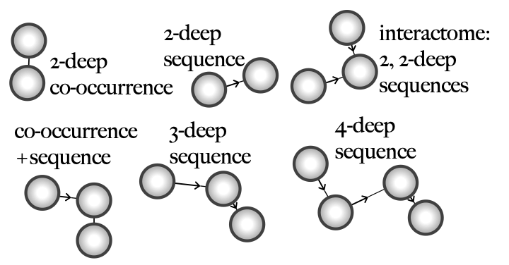

An underutilized aspect of electronic medical records is their temporal dimension. EHRs contain important temporal information about disease progression and treatment outcomes. However, EHR observations are often acquired asynchronously across time (i.e.,  measured at different time instants and sampled irregularly in time) and include sparse and heterogeneous data. 

The record of the EHR diagnosis and its time stamp may not give the true disease state or the actual onset of the disease. This property provides
challenges for directly applying standard temporal analysis methods to clinical
data recorded in EHRs. Specically, traditional time-series analysis methods
can not be directly applied to analyze the temporal dimensions of the discrete"
clinical data (e.g., diagnosis records) due to the temporally irregular recording of these
data.

 We have developed a novel sequential pattern mining algorithm, the transitive sequential pattern mining (tSPM), to construct temporal data representations from EHR data for application in downstream AL/ML algorithms. 
In the tSPM algorithm, we use of first record (rather than all records) is a major difference in the way sequential patterns are mined in tSPM to handle the repeated problem list entries.

It is important to emphasize that we call the sequential pairs in the tSPM approach transitive sequences as they embody distinctive modifications to the conventional sequential pattern mining (SPM). Imagine a sequential pattern where observation `A` happened right before `B`, and `B` happened right before `C` (`A` ⇒ `B` ⇒ `C`). SPM mines subsequences `A` ⇒ `B` and `B` ⇒ `C`. To account for the potential biases in EHRs, the transitive sequencing algorithm mines sub-sequences `A`&ast; ⇒ `B`&ast;, `B`&ast; ⇒ `C`&ast;, but also `A`&ast; ⇒ `C`&ast; from the sequence `A`&ast; ⇒ `B`&ast; ⇒ `C`&ast;, where `A`&ast; , `B`&ast;, and `C`&ast; are the first records of `A`, `B`, `C` in the database.

We start with mining 2-deep sequences:

 

We can connect these sequences to create 3-deeps:

 

Then we can continue connecting to shape more complex representations 
(`interactomes`) from n-deep sequences that are also vertically connected.

 

 We can do the connection between sequences through our dimensionality reduction algorithm

Unlike most Deep Learning approaches that have been developed to improve prediction, tSPM starts with user interpretability and works backwards to the technology.
