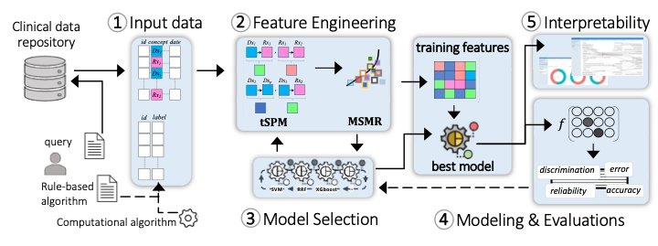

Healthcare research and industry have been increasingly progressive in the translation and implementation of Machine Learning (ML) to improve outcomes and lower costs. For a typical healthcare researcher, however, the process of designing and deploying complex ML models on clinical data is not as buttoned-down as running a typical enterprise IT application, such as EHR cohort query tools. On the algorithms, technical advances are made on a regular basis by the broader ML community, mostly in computer vision and language models. However, `Machine Learning Operations (MLOps)` in the context of healthcare data in general, and specifically structured clinical data stored in electronic health records (EHRs), requires `data-centric` approaches to respect the data governance and meet usability and `interpretability` considerations in healthcare. Further, EHR data are known to embody noise, which may be introduced through the recording processes and/or various mechanisms such as observational error, misapplication, and healthcare access inequalities. As a result, direct application of standard ML algorithms to EHR data without a data-centric approach may introduce or worsen underlying systemic bias. 

MLHO is a `Thinkin'` **Machine Learning** pipeline for modeling **H**ealth **O**utcomes. Thinkin', because the algorithm is not the center. Thinkin', because it learns representations over time, as the outcome phenotype evolves. 

<figcaption align = "center"><b> The 5 modules of MLHO pipeline for clinical MLOps</b></figcaption>

The design principles of MLHO enable Machine Learning Operations (MLOps) by emphasizing (a) a data-centric pipeline allowing multiple choices of classification algorithms to (b) prioritize fitness-for-use on (c) EHR’s structured data in order to create (d) clinically interpretable models for identifying accurate patient cohorts and predicting outcomes. 

**1.** **Input data model** 

MLHO works on a simple data model that nearly any standard common data model (e.g., OMOP, i2b2, PCORNet, Sentinel) can be transformed to, in real-time, to develop an ML model. To implement MLHO, 2 tables are needed: 1) a table containing training labels and patient numbers, and 2) a long clinical table with 3 columns containing patient numbers, clinical concepts (e.g., diagnosis/medication code), and dates, that comprise the modeling features. The labels can be provided by the user as a rule-based algorithm, generated by other intermediary algorithms (as in semi-supervised ML), or curated by experts. Generation of the long clinical table can be streamlined in a query tool. For clinical measurement data such as labs, a 4th column can be added to the clinical table.

**2.** **Feature engineering**  
MLHO is equipped with novel algorithms for temporal representation mining (tSPM) and high-throughput dimensionality reduction (MSMR). The transitive Sequential Pattern Mining (tSPM) algorithm provides a modified sequencing procedure to address some of the issues caused by the recording processes in EHRs. We have demonstrated its utility in improving computational phenotyping and predictive modeling performance and interpretability.2,3 MLHO also includes a formal dimensionality reduction procedure that aims to minimize sparsity and maximize relevance (MSMR), leveraging information-theoretic techniques to provide the best trade-off between accuracy and stability. Transitive sequences present more precise information by reducing some of the noise in the EHR data. Additionally, the sequences are not limited to just combinations of diagnoses but include and leverage other structured data elements including medications, procedures, and laboratory codes. The MSMR algorithm allows for the seamless discovery of these precise sequential record combinations as well as expert-curated features. Across the MLOps cycle in MLHO, feature engineering takes the longest time and most computational resources to ensure that complex noisy EHR data are translated into a machine-readable form with reduced noise. 

**3.** **Iterative model selection**  
Outside of unstructured problems (e.g., images/video/sound/text), where advanced Neural Network-based solutions (e.g., Deep Learning) often provide the best learning accuracy, simpler algorithms (e..g., regularizations of decision trees and common regression models) are known to perform very well in learning tasks from standard tabular data. MLHO’s model selection module provides a wrapper to many statistical learning algorithms that are available in different R packages. This capability allows the user to test the performance of a slew of available classification/regression algorithms.  The model selection module is integrated with the feature engineering module, which together and through a set of iterations enable simultaneous feature and model selection.

**4.** **Modeling and evaluations**  
Once the final set of features and the most suitable modeling algorithm are identified, MLHO enables unified modeling and model evaluations, in which the user can train the final model and evaluate a comprehensive set of performance metrics..

**5.** **Interpretability**  
The final model identifies the specific structured data (including diagnoses, medications, laboratory tests, and procedures) and the temporal relationship to one another, in order to identify the cohort or outcome. MLHO provides an interactive visualization dashboard to construct pathways from important temporal representations. A researcher implementing the model can then examine these clinically meaningful, temporal features, to understand exactly how the model works.

---
<small>icon made by <a href="https://www.flaticon.com/free-icons/devops" title="SBTS2018 - Flaticon">SBTS2018 - Flaticon</a> from <a href="https://www.flaticon.com/" title="Flaticon">www.flaticon.com</a></small>
